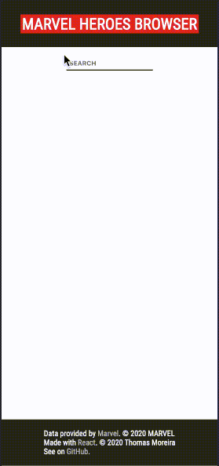

# Demo

***

[Version française](#version-française) 
[English version](#english-version)

# Version française

## A propos

**Marvel Heroes Browser** est un moteur de recherche pour super-héros et personnage de l'Univers Marvel. 
Ce projet a été bootstrapped par [Create React App](https://github.com/facebook/create-react-app). 
Les données sont fournies par [Marvel](http://marvel.com) via leur API. En apprendre plus [ici](https://developer.marvel.com/).

## Comment voir ce projet

Le projet est toujours en cours d'amélioration.  
Pour le voir en action, depuis répertoire du projet, vous pouvez executer la commande :

### `npm install` puis `npm start`

ou

### `yarn install` puis `yarn start`

Cela lancera l'application en mode développement. 
Ouvrez [http://localhost:3000/marvel-heroes-browser](http://localhost:3000) pour y accéder depuis navigateur.
NB : l'app est à utiliser en local *seulement* (via localhost). En mode développement, React utilise localhost en tant que proxy et non l'adresse IP.

### Clé API

Pour utiliser l'API Marvel il vous faut une clé. Vous pouvez en obtenir une [ici](https://developer.marvel.com/). 
Des instructions pour utiliser votre propre clé se trouvent dans les fichiers du répertoire `src/customs/`.

## Amélioration à venir

Dû à de nombreux projets à réaliser en parallèle en ce moment, l'ajout de features et les optimisation réalisables seront ajoutées au fur et à mesure.

### Todo list à l'heure actuelle :

- backend : optimisation de la requête à l'API. Implementer du 
- frontend : afficher une liste des comics, films et séries dans lesquels un personnages apparaît et proposer des liens externes vers des ressources pour en apprendre plus

# English version

## About

**Marvel Heroes Browser** is a search-engine for super-heroes and characters from the Marvel Universe. 
This project was bootstrapped with [Create React App](https://github.com/facebook/create-react-app). 
The data is provided by [Marvel](http://marvel.com) through their API. Learn more [here](https://developer.marvel.com/).

## How to check this project

The project is still being further improved.  
To check it out, in the project directory, you can run:

### `npm install` then `npm start`

or

### `yarn install` then `yarn start`

### API key

To use the Marvel API you need a key. You can get one [here](https://developer.marvel.com/). 
Instructions on how to use your own key can be found within the files of `src/customs/` directory.

Ths will run the app in the development mode. 
Open [http://localhost:3000](http://localhost:3000/marvel-heroes-browser) to view it in the browser.
NB: the app is to be used locally *only* (via localhost). In development mode, React uses localhost as a proxy and not the IP address.

## Improvments to come

Due to the many projects going on in the same time period, the addition of features and potential optimizations will be added as time goes on.

### Todo list at the moment :

- backend: optimization of the request to the API. Implementing 
- frontend: display a list of comic books, movies and series in which a character appears and provide external links to resources to learn more